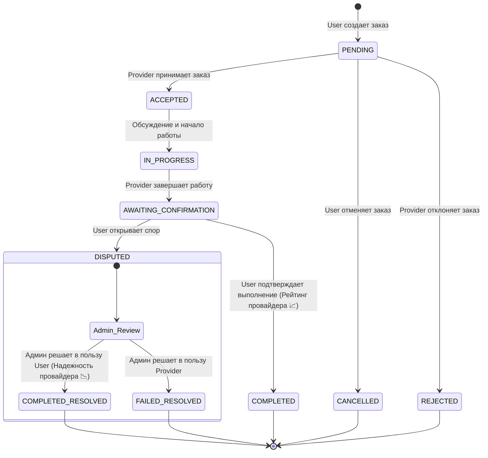

# 🇺🇿 HalQil — Mahalliy Xizmat Marketplace

<p align="center">
  
  
  
  
</p>

---

## 🚀 О проекте (Loyiha haqida)

**HalQil** — это современный маркетплейс услуг нового поколения для Узбекистана. Платформа помогает пользователям мгновенно находить проверенных исполнителей для решения бытовых и профессиональных задач (уборка, ремонт, IT-услуги, репетиторство, доставка и многое другое). 

Проект является технологичным и адаптированным аналогом мировых сервисов *YouDo* и *TaskRabbit* для рынка Центральной Азии.

### 👥 Три ключевые роли на платформе:
1. **👤 USER (Foydalanuvchi)** — обычный клиент. Может создавать заказы, выбирать лучших исполнителей, общаться с ними в чате в реальном времени и оценивать их работу.
2. **💼 PROVIDER (Provayder)** — специалист/исполнитель. Может откликаться на заказы, настраивать свое расписание, перечень оказываемых услуг и прайс-лист, а также объединяться в организации.
3. **👑 SUPER_ADMIN (Super Admin)** — системный администратор. Обладает полным контролем над платформой: модерирует заявки на получение статуса исполнителя, управляет пользователями (блокировка, заморозка), разрешает споры в заказах (диспуты) и делает рассылки системных уведомлений.

---

## 🛠 Технологии (Texnologiyalar)

### 🖥 Backend:
* **Python 3.14** + **Django 6.0**
* **Django REST Framework (DRF)** — построение гибкого RESTful API
* **Django Channels** — поддержка WebSocket для мгновенных сообщений и уведомлений
* **JWT авторизация** (`djangorestframework-simplejwt`) — безопасная авторизация без сессий
* **CORS** (`django-cors-headers`) — безопасные кросс-доменные запросы
* **PostgreSQL / SQLite3** — хранение реляционных данных

### 🎨 Frontend:
* **Next.js 16 (App Router)** — современный веб-фреймворк с серверным рендерингом (SSR)
* **TypeScript** — строгая типизация для стабильности кода
* **TailwindCSS** — стильный и адаптивный дизайн интерфейса
* **Zustand** — быстрое и легкое управление глобальным состоянием
* **Axios** — HTTP-клиент с интерцепторами для автоматического обновления JWT токенов

---

## 📁 Структура проекта (Loyiha tuzilishi)

```text
HalQil/
├── backend/
│   ├── config/             ← Настройки проекта Django, маршруты, WSGI/ASGI
│   ├── apps/
│   │   ├── accounts/       ← Авторизация, кастомный User, профили пользователей
│   │   ├── providers/      ← Профили исполнителей, скиллы, расписание, заявки
│   │   ├── catalog/        ← Категории услуг, скиллы, справочники (районы)
│   │   ├── orders/         ← Заказы, отзывы, споры
│   │   ├── notifications/  ← Система уведомлений (БД + WebSocket)
│   │   ├── organizations/  ← Профили и членство в организациях исполнителей
│   │   └── admin_panel/    ← API панели управления для супер-администратора
│   └── utils/              ← Утилиты, кастомные бекенды авторизации, permissions
└── frontend/
    ├── app/                ← Страницы приложения (Next.js App Router)
    ├── components/         ← Переиспользуемые UI компоненты интерфейса
    ├── lib/                ← Клиенты для API (Axios), функции авторизации
    ├── store/              ← Хранилище состояния Zustand (Auth, Orders)
    └── types/              ← TypeScript интерфейсы и типы данных
```

---

## ⚙️ Установка и запуск (O'rnatish va ishga tushirish)

### 📋 Требования
* **Python 3.10+**
* **Node.js 18+**
* **PostgreSQL** (или встроенная SQLite3 для локальной разработки)

---

### 🐍 Настройка бэкенда (Backend)

1. **Клонируйте репозиторий и перейдите в директорию backend:**
   ```bash
   git clone https://github.com/Kira-off/HalQil.git
   cd HalQil/backend
   ```

2. **Создайте и активируйте виртуальное окружение:**
   ```bash
   python -m venv venv
   # Для Windows:
   venv\Scripts\activate
   # Для macOS/Linux:
   source venv/bin/activate
   ```

3. **Установите все зависимости:**
   ```bash
   pip install -r requirements.txt
   ```

4. **Создайте файл конфигурации окружения `.env` в корне папки `backend/`:**
   ```env
   SECRET_KEY=your-super-secret-key-here
   DEBUG=True
   DB_NAME=halqil
   DB_USER=postgres
   DB_PASSWORD=your_password
   DB_HOST=localhost
   DB_PORT=5432
   CORS_ALLOWED_ORIGINS=http://localhost:3000
   ```

5. **Примените миграции базы данных:**
   ```bash
   python manage.py makemigrations
   python manage.py migrate
   ```

6. **Создайте учетную запись супер-администратора (SUPER_ADMIN):**
   ```bash
   python manage.py createsuperuser
   ```

7. **Запустите сервер разработки Django (на порту 8000):**
   ```bash
   python manage.py runserver 8000
   ```

---

### ⚛️ Настройка фронтенда (Frontend)

1. **Перейдите в директорию frontend:**
   ```bash
   cd ../frontend
   ```

2. **Установите Node-зависимости:**
   ```bash
   npm install
   ```

3. **Запустите Next.js сервер в режиме разработки (на порту 3000):**
   ```bash
   npm run dev
   ```

---

### 🔗 Доступные адреса:
* **Фронтенд веб-интерфейс:** [http://localhost:3000](http://localhost:3000)
* **Интерфейс Backend API:** [http://localhost:8000/api](http://localhost:8000/api)
* **Панель управления Django Admin:** [http://localhost:8000/admin](http://localhost:8000/admin)

---

## 🔑 Основные API Эндпоинты (API Marshrutlari)

### 🔐 Авторизация (Auth)
* `POST /api/auth/register/` — Регистрация нового аккаунта
* `POST /api/auth/login/` — Авторизация (получение Access & Refresh JWT по username и паролю)
* `POST /api/auth/refresh/` — Обновление истекшего Access-токена
* `POST /api/auth/logout/` — Выход из системы (устанавливает статус `is_online=False`)

### 👤 Пользователи (Foydalanuvchilar)
* `GET /api/auth/users/me/` — Получить информацию о своем профиле
* `PATCH /api/auth/users/me/` — Обновить личные данные своего профиля
* `GET /api/auth/users/<uuid:id>/` — Просмотр публичного профиля другого пользователя

### 📚 Каталог услуг (Katalog)
* `GET /api/catalog/categories/` — Получение структуры активных категорий с их навыками (skills)
* `GET /api/catalog/districts/` — Список доступных районов Ташкента (static list)

### 💼 Профили провайдеров (Provayderlar)
* `GET /api/providers/` — Список активных провайдеров (с фильтрацией по категории, району, занятости и поиском)
* `GET /api/providers/<int:id>/` — Полный детальный профиль исполнителя
* `POST /api/provider/apply/` — Подача заявки на получение роли провайдера (доступно только пользователям `USER`)
* `GET /api/provider/my-application/` — Просмотр статуса своей последней заявки
* `GET/PATCH /api/provider/profile/` — Управление своей анкетой (только для `PROVIDER`)
* `GET/POST /api/provider/schedule/` — Настройка и пакетное обновление расписания работы исполнителя
* `POST /api/provider/skills/` — Привязка новых навыков/услуг к профилю провайдера

### 🛒 Заказы и Чат (Buyurtmalar va Chat)
* `GET /api/orders/` — Просмотр списка своих заказов (автоматически фильтрует по текущей роли)
* `POST /api/orders/` — Создание нового заказа (доступно только роли `USER`)
* `GET /api/orders/<int:id>/` — Детальная информация о заказе
* `PATCH /api/orders/<int:id>/cancel/` — Отмена заказа (доступно только заказчику и только в статусе `PENDING`)
* `PATCH /api/orders/<int:id>/accept/` — Принятие заказа исполнителем (перевод в `ACCEPTED` с автосообщением в чат)
* `PATCH /api/orders/<int:id>/reject/` — Отклонение заказа исполнителем с указанием причины
* `PATCH /api/orders/<int:id>/finish/` — Завершение работы исполнителем (перевод в `AWAITING_CONFIRMATION`)
* `PATCH /api/orders/<int:id>/confirm/` — Подтверждение завершения заказчиком (`COMPLETED` с обновлением надежности провайдера) или открытие спора (`DISPUTED`)
* `GET/POST /api/orders/<int:id>/messages/` — Чтение и мгновенная отправка сообщений внутри чата заказа

### 🔔 Уведомления (Bildirishnomalar)
* `GET /api/notifications/` — Получить список личных и глобальных уведомлений
* `PATCH /api/notifications/<int:id>/read/` — Отметить уведомление как прочитанное

### 🏢 Организации исполнителей (Tashkilotlar)
* `GET /api/organizations/` — Получить список всех зарегистрированных компаний
* `GET /api/organizations/<int:id>/` — Просмотр подробного профиля организации
* `POST /api/provider/organization/apply-create/` — Создать организацию (только для `PROVIDER`, текущий исполнитель становится владельцем)
* `POST /api/provider/organization/apply-join/` — Подать заявку на вступление в организацию в качестве участника

### 👑 Супер-Админ Панель (Faqat Super Admin uchun)
* `GET /api/admin/users/` — Список всех зарегистрированных пользователей системы с поиском и фильтрацией
* `PATCH /api/admin/users/<uuid:id>/role/` — Смена системной роли любого пользователя
* `PATCH /api/admin/users/<uuid:id>/freeze/` — Заморозка / разморозка аккаунта пользователя (`ACTIVE` <-> `FROZEN`)
* `PATCH /api/admin/users/<uuid:id>/block/` — Блокировка / разблокировка учетной записи
* `DELETE /api/admin/users/<uuid:id>/` — Мягкое удаление пользователя (`status = DELETED`)
* `GET /api/admin/applications/` — Список поданных заявок на получение роли исполнителя
* `PATCH /api/admin/applications/<int:id>/approve/` — Одобрение заявки (автоматически создает профиль провайдера и привязывает выбранные скиллы и районы)
* `PATCH /api/admin/applications/<int:id>/reject/` — Отклонение заявки с указанием причины в `rejection_note`
* `GET/POST /api/admin/categories/` — Просмотр и создание категорий услуг
* `PATCH /api/admin/categories/<int:id>/toggle/` — Активация / деактивация категорий услуг
* `POST /api/admin/skills/create/` — Создание новых навыков внутри категорий
* `PATCH /api/admin/skills/<int:id>/toggle/` — Активация / деактивация навыков
* `POST /api/admin/notifications/broadcast/` — Рассылка уведомлений: массовая по ролям или глобальный системный баннер (`is_global=True`)
* `GET /api/admin/orders/disputed/` — Просмотр всех заказов, по которым открыт спор
* `PATCH /api/admin/orders/<int:id>/resolve/` — Вынесение вердикта по спору в пользу заказчика (статус `COMPLETED`, понижение надежности провайдера) или исполнителя (статус `FAILED`)

---

## 📊 Жизненный цикл заказа (Buyurtma hayotiy sikli)



---

## 🔐 Роли пользователей и права доступа (Rollar)

| Роль (Rol) | Описание возможностей | Права на API эндпоинты |
| :--- | :--- | :--- |
| **USER** | Заказывает услуги, ведет переписку, оплачивает работу, инициирует споры, оценивает исполнителей. | Доступ к созданию заказов, отмене, подтверждению, просмотру каталога и исполнителей. |
| **PROVIDER** | Оказывает услуги, настраивает прайс-лист, расписание работы, принимает заказы, завершает работу, подает заявки в организации. | Доступ к принятию, отклонению и завершению заказов, управлению своим профилем и услугами. |
| **SUPER_ADMIN** | Имеет абсолютные права. Модерирует заявки на провайдеров, блокирует/замораживает учетные записи, решает споры по заказам, управляет структурой категорий и рассылает уведомления. | Доступ ко всей супер-админ панели (`/api/admin/*`). Полный доступ к Django Admin. |

---

## 🌐 WebSocket Соединения (WebSocket Ulanishlari)

Для обеспечения мгновенной отправки сообщений и уведомлений на платформе настроена поддержка WebSocket соединений через **Django Channels**:

* **💬 Чат внутри заказа (Real-time Chat):**
  `ws://localhost:8000/ws/chat/<int:order_id>/`
* **🔔 Персональные и системные уведомления (Real-time Notifications):**
  `ws://localhost:8000/ws/notifications/`

---

## 🗺 Дорожная карта развития (Yo'l xaritasi) — v0.2.0+

- [ ] 💳 **Интеграция систем оплаты:** Подключение платежных шлюзов Payme, Click и Uzum для безопасной сделки.
- [ ] 🤖 **Искусственный Интеллект:** Рекомендательная система на основе ИИ для подбора идеального исполнителя по описанию задачи.
- [ ] 📍 **Интеграция с картами:** Просмотр исполнителей и заказов на интерактивной карте в реальном времени (Yandex Maps / Leaflet).
- [ ] 📱 **Мобильные приложения:** Разработка нативных мобильных приложений на React Native для iOS и Android.
- [ ] 🎟 **Премиум-подписки:** Тарифные планы для исполнителей с приоритетным показом в списке и расширенной аналитикой.
- [ ] 📞 **Интеграция видеозвонков:** Возможность быстрого созвона заказчика с исполнителем прямо в чате заказа.
- [ ] 🌐 **Полная мультиязычность:** Перевод интерфейса на узбекский (`uz`), русский (`ru`) и английский (`en`) языки.

---

## 👥 Команда проекта (Loyiha jamoasi)

* **Backend Architect & Lead Developer:** [Rustam](https://github.com/Kira-off) — проектирование базы данных, разработка REST API, интеграция JWT, WebSocket уведомлений, системы диспутов и админской логики.
* **Frontend Engineer & UI/UX Designer:** [Jasur](https://github.com/Kira-off) — разработка Next.js веб-интерфейса, реализация состояния на Zustand, Axios интерцепторы, интеграция верстки с Tailwind CSS.

---

## 📄 Лицензия (Litsenziya)

Этот проект распространяется под лицензией **MIT License**. Подробнее см. в файле [LICENSE](LICENSE).

---
<p align="center">Разработано с ❤️ для рынка Узбекистана.</p>
